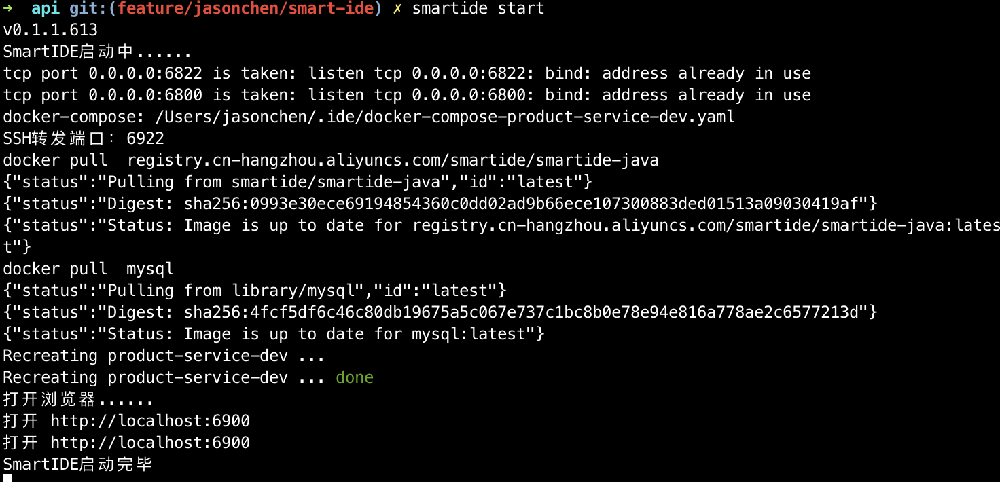

# 快速开始

安装smartide，参考 https://smartide.dev/zh/docs/getting-started/install/

```
git clone https://github.com/idcf-boat-house/boat-house-backend.git
cd /boat-house-backend/src/product-service/api
smartide start
```

如下图所示，代表启动成功




# 开发调试
1. 在浏览器中，点击 terminal ，点击 new terminal， 在打开的 terminal 窗口中运行 “mvn package”，直至运行结束
<image style='width:80%' src='images/java-mvn-package-success.png' />
期间遇到提示 “The workspace contains Java projects. Would you like to import them? ”，请点击yes
<image style='width:80%' src='images/java-theia-java-import.png' />
2. 点击窗口左侧的debug按钮，点击“绿色播放按钮”
<image style='width:80%' src='images/java-debug-start.png' />
查看调试端口是否已经转发成功，成功后可以在浏览器中打开 http://localhost:port/api/v1.0/swagger-ui.html，可以进行接口调试
<image style='width:80%' src='images/java-rest-api.png' />


# 配置文件
[.ide.yaml](.ide.yaml)